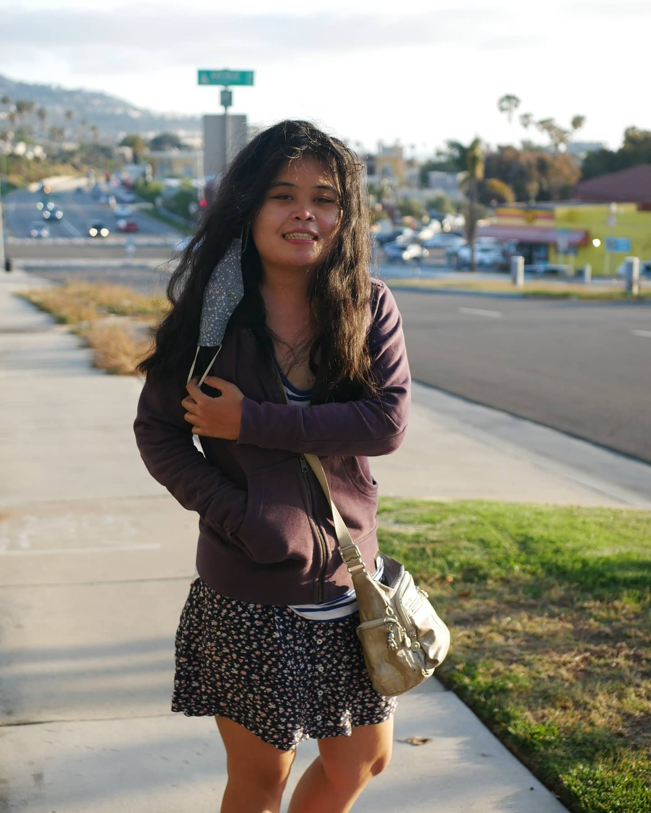

I am a trained Data Analyst and Data Scientist, currently looking for rewarding work in Data Science where I can apply my skills and talents. I went to Smith College and doubled majored in <b> <i> Mathematics </i> </b> and <b> </i> Statistical and  Data Sciences </i> </b> . I also have a M.S. degree in <b> <i> Statistics </i> </b> from the University of California-Riverside. \
\
I recently worked as a statistician at UCLA Health. I have hands-on experience applying statistical methodologies to real-world challenges. I also have gained pretty extensive knowledge of R and a strong background in Python. \

In addition to my technical skills, I specialize in business analytics, data visualization, and digital online data storytelling. I have a passion for communicating data-driven insights to both technical and non-technical audiences.
  

 {width=250px} 

\

## contact info:
$\textbf{Email:}$ julialee64@gmail.com 

$\textbf{Github:}$ https://github.com/JuliaClaireLee

$\textbf{Linkedin:}$ 
https://www.linkedin.com/in/julia-lee-5201b0156/

