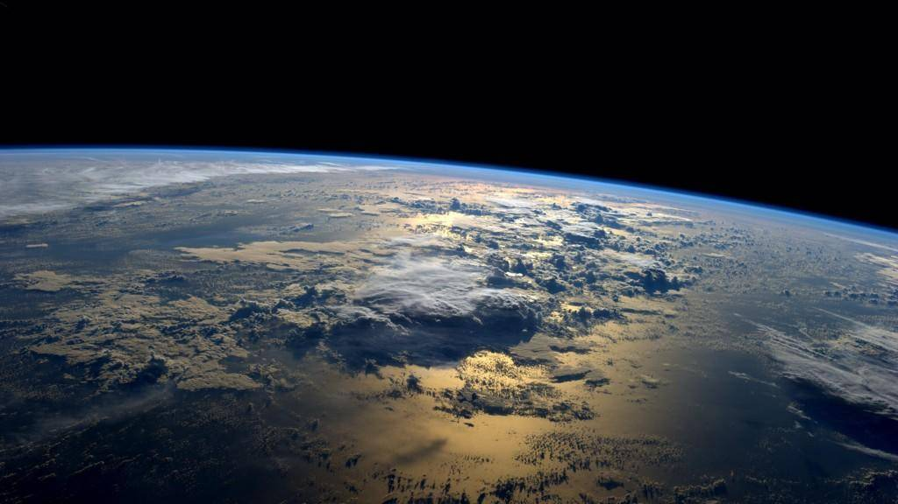

It's the end of week 5 of quarantine/physical distancing. It has been a long week but I'm so lucky that I don't need to leave my dwelling and I'm fine. I'm not unemployed, I have health insurance, and I'm young and healthy. For me the worst was that I spent 60 minutes waiting for my elderly professor figure out Zoom. I'm so privileged and lucky. Thank you to all our heroes who risk their lives everyday. 

This virus makes me realize how small and interconnected  our pale blue dot actually is. 

 <iframe width="560" height="315" src="https://www.youtube.com/embed/wupToqz1e2g" frameborder="0" allow="accelerometer; autoplay; encrypted-media; gyroscope; picture-in-picture" allowfullscreen></iframe> 

  
"An Earth in crisis is still an Earth worth returning to" - Astronaut Andrew Morgan^[https://www.youtube.com/embed/VQLi2GYVULc?start=306]  

   