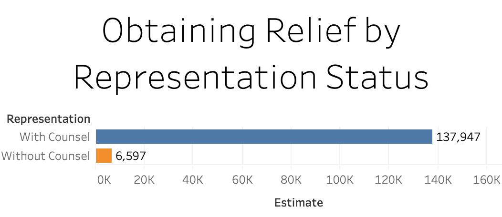
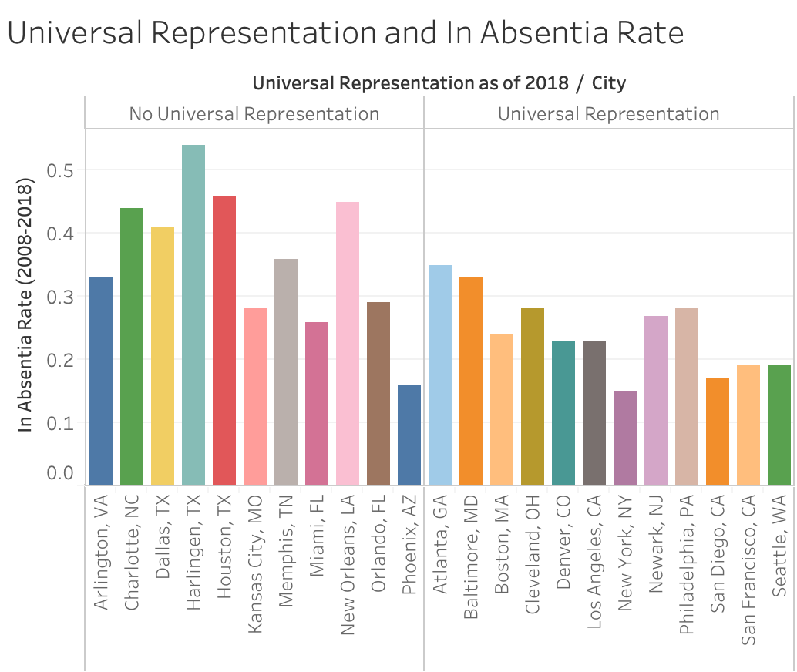
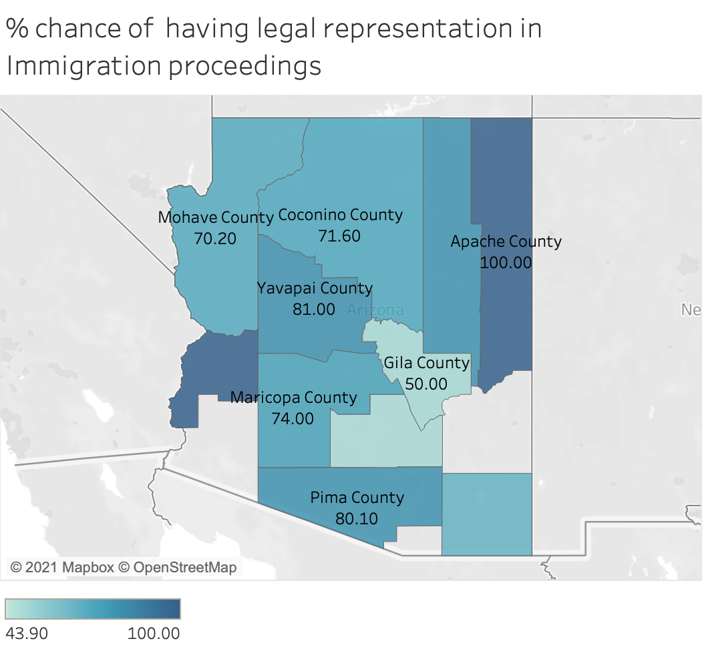
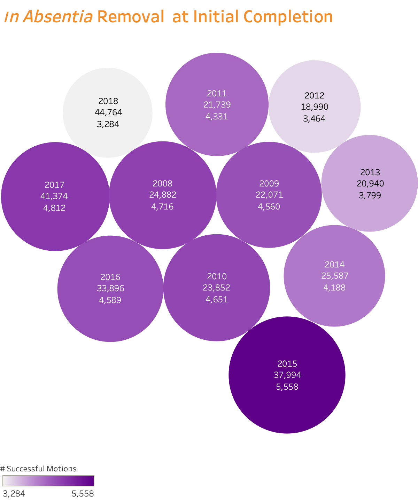
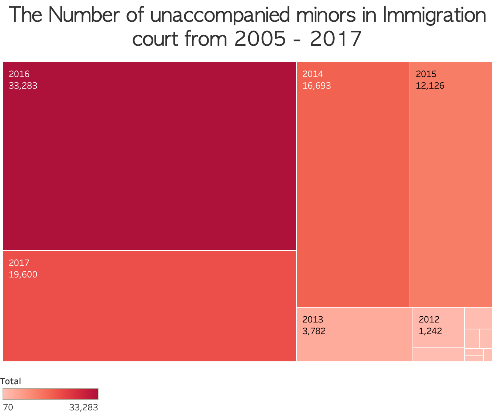
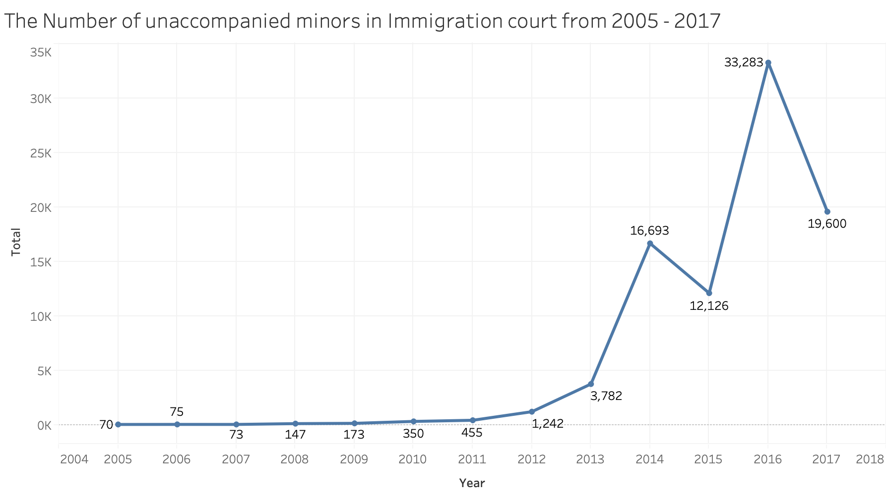

```{r setup, include=FALSE}
knitr::opts_chunk$set(echo = TRUE)
library(readr)
library(ggplot2)
library(tidyverse)
install.packages("usmap")
library(usmap)

library(ggthemes)
data <- read_csv("data-KIK4y.csv")
library(readr)
library(leaflet)
#install.packages("tidygeocoder")
library(tidygeocoder)
library(dplyr)
#install.packages("zipcodeR")
library(zipcodeR)
#install.packages("maps")
library(tidyverse)
library(maps)
#install.packages("devtools")
library(devtools)
#install.packages("viridis")
library(viridis)
#devtools::install_github("hrbrmstr/albersusa")
library(ggthemes)
#install.packages("viridisLite")
library(viridisLite)
library(albersusa)
library(ggmap)
#install.packages("ggrepel")
#install.packages("dplyr")
library(data.table)
library(cluster)
library(factoextra)
library(ape)
library(ggdendro)
library(dendextend)
#install.packages('circlize') 
library(circlize) 
```
 
## Selected works that I did for PCJFA:















```{r, message=FALSE, warning=FALSE, echo=FALSE}

de<-data.frame(c(2019,2020,2021), c(1023767,1262765,1357820))
names(de) <- c("fiscal-year","total-us-backlog-immigration-court")
data <- rbind(data, de)

ggplot(data = data, aes(x=`fiscal-year`, y = `total-us-backlog-immigration-court`)) +
  geom_point(color = "green") +
  geom_smooth(color = "red") +
  geom_vline(xintercept  = 2003, color = "dark green", linetype="dotted") +
  geom_vline(xintercept  = 2021) +
  ggtitle("Total Backlogged Cases in U.S. Immigration Courts") +
  theme_fivethirtyeight() +
   annotate("text", x = 2001, y= 369600, label = "ICE was created in 2003", color = "blue") +
   annotate("text", x = 2016.25, y= 1357820, label = "As of 2021 there were 1.36 M", color = "blue") +
   annotate("text", x = 2016.25, y= 1287820, label = "cases in the backlog", color = "blue") +
  ylab("Cases in U.S. Immigration Courts")
```



```{r}
plot_usmap(data = statepop, values = "pop_2015", color = "red") + 
  scale_fill_continuous(name = "Population (2015)", label = scales::comma) + 
  theme(legend.position = "right")
```